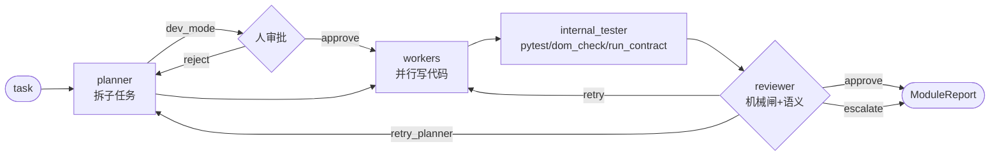

# programmer1 — 通用代码模块单元

**定位**：纯业务无关的编码执行器。接收一个任务描述，拆成子任务，并行写代码，审查通过后返回报告。不知道也不关心外层是什么业务。

---

## 公共 API

```python
from programmer1.modules.code_module import build_code_module, run_module
from programmer1.engine.agent import run_agent, run_parallel, Job
from programmer1.config import ModuleConfig
from programmer1.schemas import Task, AgentResult
```

| 函数 | 用途 |
|------|------|
| `build_code_module(cfg)` | 返回编译好的 LangGraph 子图，接入上层图 |
| `run_module(cfg, task)` | 独立运行一个模块（CLI / 测试用） |
| `run_agent(...)` | 单次模型调用（planner/reviewer 用） |
| `run_parallel([Job])` | 并行模型调用（workers 用） |

---

## 模块内部流程



---

## 引擎层（engine/）

```
run_agent / run_parallel
    │
    ├─ registry.resolve(smart_level) → EngineSpec(provider, model, env, effort)
    │
    └─ providers/
          codex.py          ← Codex 订阅（subprocess codex CLI）
          claude.py         ← CC 订阅 or CC+DeepSeek（claude-agent-sdk, env 切换）
          anthropic_chat.py ← Anthropic Messages API（httpx，简单 chat）
```

**smart_level 对照表（`engine/registry.py`，热插拔）**

| level | provider | model | 典型用途 |
|-------|----------|-------|---------|
| 6 | codex | 订阅默认 effort=high | 高算力备用，替代 Opus |
| 5 | codex | 订阅默认 effort=high | planner 规划、arbiter 裁决 |
| 4 | codex | 订阅默认 effort=high | reviewer 代码审查，替代 Sonnet |
| 3 | deepseek | deepseek-v4-pro | worker 写代码（默认；失败后上报）|
| 2 | glm | glm-4 | 轻量备用；无 key/API 错误升 L3 |
| 1 | deepseek | deepseek-v4-flash | 极轻量备用；无 key/API 错误升 L3 |

改模型只需修改 `registry.py`，上层代码零修改。level 1/2 无 key 或 API 错误只升 level 3 DeepSeek Pro；level 3 再失败则上报模块失败，不自动使用 Codex。

---

## ModuleConfig 旋钮

```python
ModuleConfig(
    name           = "backend",          # 模块名
    workspace      = "/path/outside/repo",  # agent 可写目录（必须在仓库外）
    readonly_dirs  = ["/other/module"],  # 只读上下文
    real           = True,               # False = stub（免费跑结构）
    planner_level  = MODULE_PLANNER_LEVEL,
    reviewer_level = MODULE_REVIEWER_LEVEL,
    # complexity_levels 从 REGISTRY 动态生成，无需手填
    # {"trivial":1,"simple":2,"medium":3,"hard":4,"complex":5,"expert":6}
    require_pytest = False,
    dev_mode       = False,              # True = planner 后暂停等人审批
    implementation_language = "python",  # frontend 填 "javascript"，校验函数规格语法
    extra_rules    = "你是后端工程师…",  # 追加到 system_prompt
)
```

---

## 关键机制

**执行契约硬闸**：planner 将 `public_api`、`internal`、`consumes`、`constraints` 写入模块自己的 `contracts/execution_contract.json`。写 worker 前先做 DSL、语言和跨模块 API preflight；worker 后 `integrated_tester1/runner.py` 跑 `run_contract`，并写 `contracts/contract_report.json`。任一失败按 `repair_target=planner|worker` 重拆或重写，reviewer 无权放行。

**顺序 worker**（sequential=true）：同文件多 worker 场景（如 index.html 骨架→渲染→交互），planner 输出 `sequential=true`，workers 节点自动切换为串行 await。并行批次（sequential=false）要求 files_allowed 互不相交。

**路径守卫**（cc_agent.py `_make_guard`）：每次 CC agent 调用绑定当前 workspace 路径，Write/Edit/Bash 重定向到 workspace 外的路径一律拒绝。

**工作区基线**：首次进入 planner 时记录文件 hash；重试不会执行 reset/checkout/clean，失败现场会保留。后续 changed_files 和文件范围检查都相对这份基线计算。重试耗尽会作为 `retry exhausted` 上报顶层 arbiter，停止而非新开一轮任务。

---

## 新增 Provider

1. 在 `engine/providers/` 新建文件，继承 `Provider`，实现 `run()` 返回 `AgentResult`
2. 在 `engine/registry.py` 加一行 `EngineSpec("new_provider", "model-name")`
3. 在 `engine/agent.py` 的 `_PROVIDERS` 字典里注册

---

## 独立运行

```bash
cd modulized_programmer
python -m programmer1.run "实现斐波那契函数"          # 真跑
python -m programmer1.graph --viz                    # 打印 mermaid 结构
```
