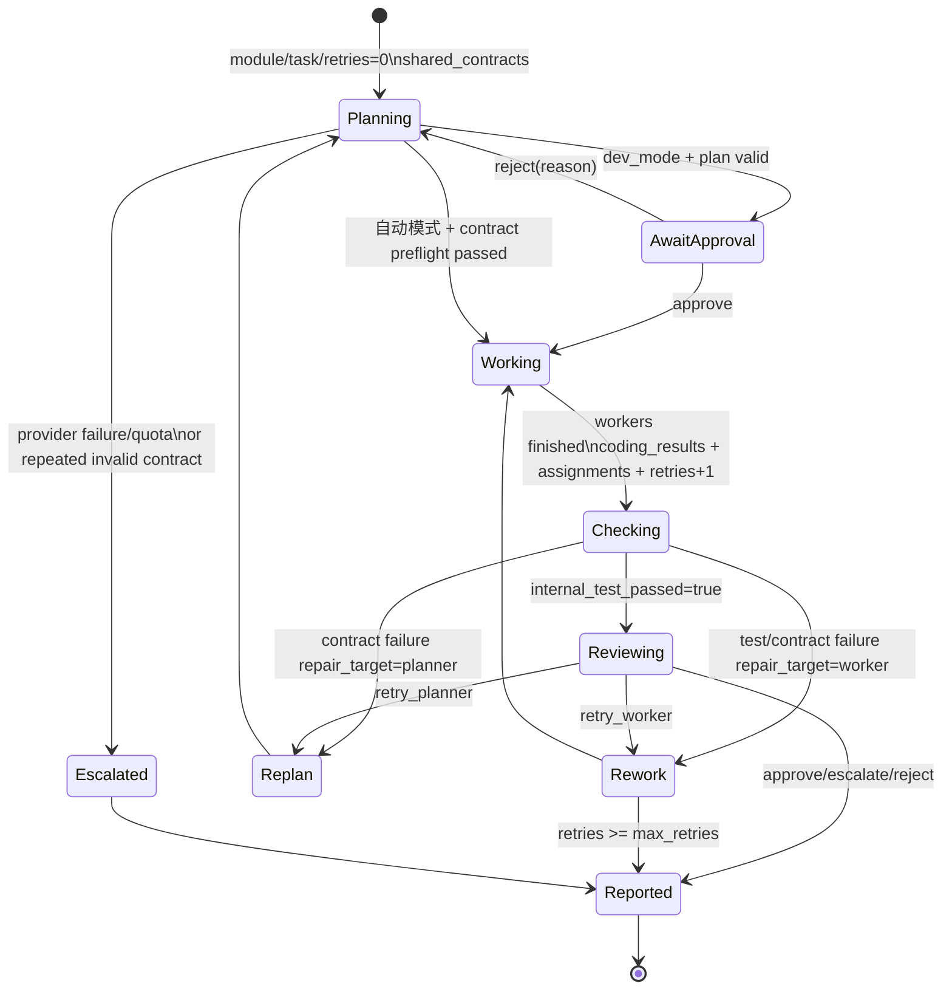
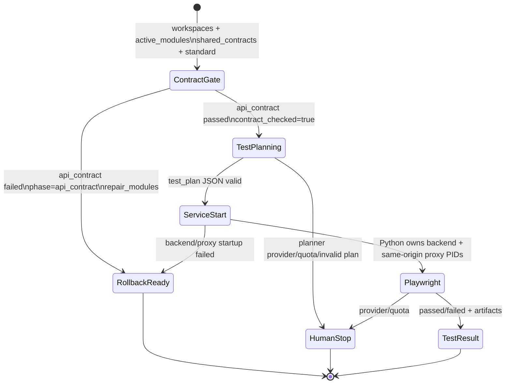

# growth-garden-builder — AI 编排主控

> **给 AI 监督者**：本文件是完整的上下文参考。监督运行时先读这里，再看 `graph.py`，然后直接跑。

---

## 定位

`growth-garden-builder` 是 skill-growth-garden 项目的**多模块 AI 编排层**。  
它接受一句自然语言需求，调度 AI 团队（`programmer1` 编码 + `test_engineer1` 测试），交付可运行代码并给出最终裁决。

项目本身**不含业务代码**——它只是一个调度框架，业务规则集中在 `arbiter.py` / `backend_cfg.py` / `frontend_cfg.py`。

---

## 三层架构

```
Layer 1  growth-garden-builder/graph.py    总调度：arbiter + dispatch + review
Layer 2  programmer1/  (submodule)         编码团队子图：backend / frontend
         test_engineer1/                   测试团队子图：contract / Python Playwright
Layer 3  programmer1 内部                  planner → workers → internal_tester → reviewer
```

### 顶层状态机（LangGraph StateGraph）

```
START
  │
  ▼
[intake]          arbiter.py：Codex L5 读需求，写 .arbiter_plan.json，拆批次（batches）
  │
  ▼
[dispatch]        graph.py：根据 cursor 和 task.owner 路由
  │
  ├─ owner="backend"  → [backend]  ─┐
  ├─ owner="frontend" → [frontend] ─┤─ 完成后回 dispatch（cursor+1）
  └─ cursor 超出       → [batch_review]
                            │
                  ┌─────────┴────────────────────────┐
              本批全部 ok=true                     任一 ok=false / quota / 上限
                 │                                      │
        有下批→dispatch；无下批→test                 retry task 或 escalate→done
                 │
              [test]   test_engineer1（contract + Python Playwright）
                                        │
                                      [review] arbiter_review_test：merge/rollback/escalate
                                        │
                                ┌───────┴──────────┐
                             merge              rollback
                                │                  │
                         [commit_push]       cursor=0 → dispatch（重跑）
                                │
                              [done]
                                │
                               END
```

### 子图内部（每个模块，Layer 3）

```
[planner]  → 拆 1~3 个函数级子任务，并产出 execution_contract（行为、文件边界、依赖）
               先做 contract definition preflight；无效契约不启动 worker
               dev_mode 时写 .plan_log.json 并等人工审批；拒绝原因回传给下一次规划
     │
[workers]  → sequential=false：asyncio.gather 并行
               sequential=true ：逐个串行（同文件多 worker 顺序追加时用）
     │
[internal_tester] → compile / pytest / dom_check / run_contract
                     run_contract：硬查本模块 execution_contract；失败按 repair_target 回到 planner 或 worker
     │
[reviewer] → ① 机械闸（越权文件）② 执行契约/测试硬闸（失败不得 approve）
             ③ 语义审查；写 .review_result.json：approve|retry_worker|retry_planner|escalate|reject
     │
   ┌─┴─────────────────────┐
 approve/escalate/reject   retry_worker / retry_planner（retries < max_retries）
     │                       │
  [report]          workers（重写） / planner（重拆契约）
     │
    END
```

---

## 数据流

```
用户输入 requirement (str)
    │
    ▼ arbiter_intake
GraphState.module_tasks = [Task(id, owner, title, files_allowed, acceptance_criteria), ...]
GraphState.cursor = 0
    │
    ▼ dispatch → backend (module_tasks[0])
ModuleState.task = Task(...)
    │
    ▼ planner
ModuleState.subtasks = [Task(...), ...]       ← 函数级拆分
    │
    ▼ workers (并行)
ModuleState.coding_results = [CodingResult(changed_files, summary), ...]
    │
    ▼ reviewer
ModuleState.review = ReviewResult(approved, action, reason, violations, suggestions)
    │
    ▼ report (→ 回 GraphState)
GraphState.module_reports.append(ModuleReport(module, ok, changed_files,
                                               acceptance_for_test,
                                               violations, suggestions))
    │
    ▼ backend report
GraphState.shared_contracts["backend"] = backend_api.json payload
    │
    ▼ dispatch → frontend（读取共享 API 契约）→ ... → test
    │
    ▼ test_engineer1
GraphState.test_result = TestResult(passed, phase, failures, artifacts)
    │
    ▼ arbiter_review_test
GraphState.decision = "merge" | "rollback" | "escalate"
GraphState.result   = 最终结论字符串
```

## State / Substate 全图（当前实现）

下图是运行时真正传递的数据。`GraphState` 是总状态；每次进入一个代码模块时，
顶层图将必要字段投影为独立的 `ModuleState`；E2E 阶段再投影为 `TEState`。
子图结束时只把明确的输出合并回上层，避免 backend、frontend、tester 的临时状态混在一起。

```mermaid
flowchart TD
    U[requirement + dev_mode] --> I[intake]
    I -->|成功| GS0[GraphState<br/>task_batches, module_tasks, cursor=0<br/>batch_cursor=0, shared_contracts={}]
    I -->|provider/quota/无任务| STOP[decision=escalate<br/>stop_reason/result -> done]

    GS0 --> D{dispatch}
    D -->|cursor 指向 backend task| B[backend ModuleState]
    D -->|cursor 指向 frontend task| F[frontend ModuleState]
    D -->|本批完成| BR[batch_review]

    B -->|ModuleReport ok=true| PUB[写 contracts/backend_api.json<br/>published_api + available_api + execution_contract]
    PUB --> GS1[GraphState.shared_contracts.backend]
    GS1 --> D
    F -->|ModuleReport| D

    BR -->|全部 report.ok=true 且有后批| NEXT[更新 batch_cursor/module_tasks/cursor=0] --> D
    BR -->|全部 report.ok=true 且无后批| T[TEState / test_engineer]
    BR -->|report.ok=false 可定位任务| RETRYB[插入 retry batch] --> D
    BR -->|quota/escalate/retry exhausted/无法定位| STOP

    T -->|api_contract 失败| R[review]
    T -->|Playwright E2E 结果| R
    R -->|passed| MERGE[decision=merge] --> CP[commit_push] --> DONE[done]
    R -->|contract/test failure 有 repair_modules| ROLL[decision=rollback<br/>从首个受影响批次重跑] --> D
    R -->|requires_human 或重试上限| STOP
```

### 1. 顶层 `GraphState`

| 阶段 | 读取字段 | 写入字段 | 下一步 |
|---|---|---|---|
| 初始 | `requirement`, `dev_mode` | — | `intake` |
| `intake` | `requirement` | `task_batches`, `module_tasks`, `cursor=0`, `batch_cursor=0`, `module_reports=[]`, `test_retries=0` | `dispatch`；失败写 `decision=escalate` |
| `dispatch` | `module_tasks`, `cursor` | — | owner 对应模块；当前 batch 完成则 `batch_review` |
| 模块返回 | 当前 task、`module_reports` | 追加 `ModuleReport`，`cursor += 1` | `dispatch` |
| backend 成功返回 | `ModuleReport`, `execution_contract` | `shared_contracts["backend"]` | 先写共享契约，再允许 frontend planner |
| `batch_review` | `task_batches`, `batch_cursor`, `module_reports` | `batch_logs`，可能替换 `module_tasks` / `task_batches` | 下一批、`test` 或 `escalate` |
| `test` | 所有成功模块 report、`shared_contracts` | `test_result` | `review` |
| `review` | `test_result`, `test_retries` | `decision=merge|rollback|escalate` | commit、回滚或结束 |
| `commit_push` | `decision=merge` | `result` | `done` |

顶层终态约束：

- 任一 `ModuleReport.ok == false` 是硬门禁，不能 `PROCEED` 到下一模块或测试。
- 任何 provider 的 quota / session limit、reviewer 格式故障、模块重试耗尽、batch 上限都会写 `decision=escalate`；不会 commit/push。
- `main()` 看到 `decision=escalate` 返回退出码 `2`。

### 2. 代码模块 `ModuleState`



| 子状态字段 | 谁写入 | 含义 |
|---|---|---|
| `task` / `module` | `graph._module_node` | 当前模块级任务及 owner。 |
| `workspace_baseline` | planner 首次进入 | 首次规划前的文件 hash 快照。所有重试均保留工作区，基于它计算真实变更；不会再 reset/checkout/clean 掉失败现场。 |
| `subtasks` | planner | 函数级 `Task[]`，带 `files_allowed`、验收、函数规格、`sequential`。 |
| `execution_contract` | planner | 本模块硬约束，包含 `public_api`、`internal`、`consumes`、`constraints`。先 definition preflight，再写 `contracts/execution_contract.json`。 |
| `assignments` | workers | task id 到模型 session id，重试时续会话。 |
| `coding_results` / `retries` | workers | 每个 worker 的实际变更摘要；`retries` 每次 worker 执行加一。模型返回 `✓` 只表示调用成功，不代表验收成功。 |
| `internal_test_passed` / `internal_test_logs` | internal tester | compile/pytest/dom_check/run_contract 的汇总和原始日志。 |
| `contract_report` | run_contract | 每项 check 的 `check_id/kind/reason/repair_target`；`planner` 表示契约坏，`worker` 表示实现坏。 |
| `review` | reviewer / 机械闸 | `approve`、`retry_worker`、`retry_planner`、`escalate`、`reject` 与原因。 |
| `report` | report node | 返回顶层的唯一模块结果 `ModuleReport(ok, changed_files, note, ...)`。 |

执行契约状态流：

```text
planner JSON
  -> validate_execution_contract (字段、语言、shared published_api)
  -> workspace/contracts/execution_contract.json
  -> worker prompt
  -> run_contract (源码、DOM、fetch、consumes、文件范围)
  -> contract_report
  -> repair_target=planner ? planner : worker
```

前端的 function spec 必须是 JavaScript `function`/`async function`；Python `def`、
`dom.elements` / `dom.required_elements` 等未知 DSL 字段在 planner preflight 就会失败。

### 3. 共享契约 `shared_contracts["backend"]`

backend 成功后，`graph._write_backend_contract()` 写
`~/gg-workspace/contracts/backend_api.json`，并将同一 payload 放入 `GraphState`：

```json
{
  "published_api": [{"method": "GET", "path": "/health"}],
  "available_api": [{"method": "GET", "path": "/health"}, {"method": "POST", "path": "/notes"}],
  "execution_contract": {"module": "backend", "...": "..."}
}
```

- `published_api`：本批 backend 新承诺的接口。frontend 本次 `consumes` 必须精确声明其 method/path，不能猜接口。
- `available_api`：静态扫描 backend 得到的完整已有接口面。它仅用来确认旧页面已有 fetch 没有调用不存在接口。
- `execution_contract`：backend 自己的实现约束；tester 要检查模块文件与共享文件是否一致。

### 4. 测试子图 `TEState`



`TEState` 输入包括 backend/frontend/contract workspaces、`shared_contracts`、`active_modules`、
验收条件和 E2E standard。输出包括：

- `test_plan`：Codex 的非空 JSON test cases；
- `contract_checked` / `contract_artifacts`：防止 `run_mcp_tests` 重复消耗一次契约检查；
- `passed`、`phase`、`failure_kind`、`failures`、`repair_modules`、`requires_human`；
- `artifacts`：`contract_check.log`、`service_startup.log`、`playwright_mcp.log`。

E2E 服务的职责分离：Python 启 FastAPI 和 `test_engineer1.proxy_server`，后者服务 frontend
静态文件并只代理 `available_api` 声明的路径到 backend，因此浏览器中的 `fetch("/health")`
保持同源。Python Playwright 按 Codex 生成的 JSON 计划操作浏览器；无论测试成功或失败，Python `finally` 都停止两个服务。

---

## 文件结构

```
growth-garden-builder/
│
├── graph.py              ★ 入口：三层图组装 + CLI + _run()
├── arbiter.py            ★ 业务裁决：AI 拆任务（file-based）+ 测试裁决
├── backend_cfg.py           BACKEND_CONFIG（FastAPI后端 ModuleConfig）
├── frontend_cfg.py          FRONTEND_CONFIG（HTML/JS前端 ModuleConfig）
│
├── programmer1/          ★ 编码子图（git submodule，纯通用，不含业务）
│   ├── engine/
│   │   ├── agent.py         run_agent() 对外唯一入口
│   │   ├── registry.py      smart_level → EngineSpec 热插拔表（改这里换模型）
│   │   ├── engine_config.py ProviderConfig（启动时读所有凭证）
│   │   ├── session.py       SessionStore（跨调用复用连接）
│   │   └── providers/
│   │       ├── base.py          AgentResult dataclass + Provider ABC
│   │       ├── cc_agent.py      CC Pro 订阅（claude-agent-sdk，含路径守卫）
│   │       ├── codex.py         Codex 订阅（subprocess）
│   │       ├── deepseek_agent.py CC SDK + DeepSeek API key
│   │       └── glm_agent.py     CC SDK + GLM API key
│   ├── modules/
│   │   ├── code_module.py   build_code_module(cfg) → 子图（planner/workers/tester/reviewer）
│   │   └── arbiter.py       arbiter_review_test（通用测试裁决）
│   ├── integrated_tester1/  程序化内部测试器（pytest/dom_check/api_contract）
│   ├── schemas.py           Task（含 sequential/test_additions）/ CodingResult / ReviewResult / ModuleReport
│   ├── state.py             GraphState（含 task_batches/batch_cursor/batch_logs）/ ModuleState
│   ├── config.py            ModuleConfig + COMPLEXITY_TO_SMART（从 registry 动态生成）
│   ├── workspace_git.py     setup_worktree / commit_workspace / push_workspace
│   └── devlog.py            会话级开发日志（写 ~/gg-workspace/devlog.md，保留最近 3 次）
│
├── test_engineer1/       ★ 顶层 E2E 测试子图（contract + Python Playwright）
│   ├── graph.py             build_test_engineer(cfg) → 子图
│   ├── nodes/plan_tests.py  Codex 读代码和契约，生成测试计划
│   ├── nodes/run_mcp_tests.py  契约硬检查 + 服务生命周期 + Python Playwright
│   └── proxy_server.py      测试专用同源静态服务器/API 代理
│
├── _deprecated_lite_tester/  旧 pytest-only tester，保留参考，不参与顶层流程
│
├── .env                  ANTHROPIC_API_KEY + DEEPSEEK_API_KEY（不入库）
├── .env.example          key 模板
├── requirements.txt
└── ARCH.md               一页纸架构说明（含 Mermaid 图）
```

---

## 模型调用层（六条通道）

所有 LLM 调用必须经过 `run_agent(smart_level=N, ...)`，禁止绕过。

| level | provider | model | 用在哪 |
|-------|----------|-------|--------|
| 6 | codex | 订阅默认 effort=high | 高算力备用，替代 Opus |
| 5 | codex | 订阅默认 effort=high | arbiter 裁决、planner 规划 |
| 4 | codex | 订阅默认 effort=high | reviewer 代码审查，替代 Sonnet |
| 3 | deepseek | deepseek-v4-pro | worker 写代码（需 key）|
| 2 | glm | glm-4 | 轻量备用（需 key；无 key/API 错误 → 升 3）|
| 1 | deepseek | deepseek-v4-flash | 极轻量备用（需 key；无 key/API 错误 → 升 3）|

**Fallback 链**：level 1/2 无 key 或 API 错误 → level 3 DeepSeek Pro；level 3 再失败则上报模块失败并停到人工。Codex 只用于显式配置的 level 4/5/6，不接管普通 worker fallback。

**凭证初始化顺序**（agent.py 模块级执行，不可改变）：
1. `ProviderConfig()` 读所有 env key
2. `os.environ.pop("ANTHROPIC_API_KEY")` → CC agent 走本地 credentials.json
3. 初始化各 Provider（key 安全保存在 cfg 里）

---

## 任务复杂度 → worker 档位

planner 输出 1-6 整数；从 `REGISTRY` 动态推导，不硬编码：

| complexity 标签 | level | 实际模型 |
|----------------|-------|----------|
| trivial | 1 | deepseek-v4-flash（fallback: L3 DeepSeek Pro）|
| simple  | 2 | glm-4（fallback: L3 DeepSeek Pro）|
| medium  | 3 | deepseek-v4-pro（失败后上报，不再自动 fallback）|
| hard    | 4 | codex effort=high |
| complex | 5 | codex effort=high |
| expert  | 6 | codex effort=high |

角色默认档位从 `programmer1/config.py` 读取：arbiter planner 默认 L5，module planner 默认 L3，module reviewer 默认 L4，test planner 默认 L3。业务模块只传 `smart_level`，provider 调用和 fallback 仍统一在 `agent.py`/`registry.py`。

---

## 工作区（代码落盘位置）

所有 AI 写的代码落到**主仓库外**的独立目录（防止 CC agent 找错 .git 根）：

| 模块 | 路径 |
|------|------|
| backend | `~/gg-workspace/backend/` |
| frontend | `~/gg-workspace/frontend/` |
| arbiter 计划文件 | `~/gg-workspace/arbiter/.arbiter_plan.json` |
| 模块内部契约 | `~/gg-workspace/<module>/contracts/execution_contract.json` |
| 跨模块 API 契约 | `~/gg-workspace/contracts/backend_api.json` |
| E2E 产物 | `~/gg-workspace/tester/contract_check.log`、`service_startup.log`、`playwright_mcp.log` |

frontend 以 `readonly_dirs` 只读挂载 backend 工作区——agent 能读真实接口代码。

---

## 环境变量

| 变量 | 必填 | 用途 |
|------|------|------|
| `ANTHROPIC_API_KEY` | ✓ | CC agent 本地凭证验证（被 pop 后 CC 走 credentials.json）|
| `DEEPSEEK_API_KEY` | L1-L3 worker 必需 | level 1/3 worker；L2 fallback 后也依赖它 |
| `GLM_API_KEY` | 可选 | level 2 worker；不填自动 fallback 到 L3 DeepSeek |
| `GLM_BASE_URL` | 可选 | GLM 兼容端点（默认 bigmodel.cn）|
| `CODEX_PATH` | 可选 | codex 二进制（默认 `~/.hermes/node/bin/codex`）|
| `GG_REAL` | 可选 | `=1` 真跑；不设则全 stub（免费看结构）|

---

## 运行方法

```bash
cd growth-garden-builder
cp .env.example .env       # 填 ANTHROPIC_API_KEY（必填）
source .venv/bin/activate

# 查看图结构（免费）
PYTHONPATH=. python -m graph --viz

# Stub 全景（免费，验证流程）
PYTHONPATH=. python -m graph "做一个乘法器"

# 真跑（烧模型配额）
PYTHONUNBUFFERED=1 GG_REAL=1 PYTHONPATH=. python -m graph "前端做一个乘法页面，后端做 /multiply 接口"
```

**DEV_MODE**（`graph.py` 顶部 `DEV_MODE = True`）：planner 拆完方案后暂停，显示子任务和执行契约摘要，等待人工审批。拒绝时可填写原因，原因会进入下一次 planner 提示词。`devlog.md` 记录每次模型调用的时间戳、模型、耗时和完整输出；关闭时仅保留摘要。

模型返回额度、配额或会话限制时，流程会返回 `escalate` 并以退出码 `2` 结束；不会进入 E2E、commit 或 push。

---

## 关键旋钮（改这里不用动其他地方）

| 旋钮 | 位置 | 说明 |
|------|------|------|
| `DEV_MODE` | `graph.py` 顶部 | planner 暂停审批开关 |
| `REGISTRY` | `programmer1/engine/registry.py` | 换模型/档位（改完自动更新复杂度表）|
| `BACKEND_CONFIG` | `backend_cfg.py` | 后端工作区/规则/git_remote |
| `FRONTEND_CONFIG` | `frontend_cfg.py` | 前端工作区/规则/git_remote |
| `ARBITER_PLANNER_LEVEL` / `MODULE_PLANNER_LEVEL` / `MODULE_REVIEWER_LEVEL` / `TEST_PLANNER_LEVEL` | `programmer1/config.py` | 各角色默认 smart_level；可用 `GG_<NAME>_LEVEL` 或 `GG_MODEL_<NAME>_LEVEL` 覆盖 |
| `MAX_MODULE_RETRIES` | `programmer1/config.py` | reviewer 失败最多重试几次 |
| `MAX_TEST_RETRIES` | `programmer1/config.py` | 测试失败最多回滚几次 |
| `BACKEND/FRONTEND_HUMAN_STANDARD` | `test_standards_cfg.py` | 铁律检查项（只有人能改）|

---

## reviewer 输出格式（必须遵守）

reviewer 必须在模块工作区写 `.review_result.json`：

```json
{
  "verdict": "approve|retry_worker|retry_planner|escalate|reject",
  "reason": "一句话",
  "violations": ["越权文件 auth.py：worker 未经授权创建"],
  "suggestions": ["若业务需要 auth.py，请 arbiter 将其加入 files_allowed"]
}
```

`_read_review_json()` 解析该文件。文件缺失或 JSON 无效一律 `escalate`，不会猜自然语言。

---

## arbiter 文件式输出（Bug 1 修复后设计）

arbiter 不用 JSON 解析文本，而是：
1. `run_agent(allowed_tools=["Read","Write"], cwd=~/gg-workspace/arbiter)`
2. Codex 用 Write 工具写 `.arbiter_plan.json`
3. 代码直接 `json.loads(file.read_text())`

好处：绕开 CC agent 的 tool-call 日志噪声；未来可加 `readonly_dirs=[backend_ws, frontend_ws]` 让 arbiter 审代码。

---

## 已知限制 / 待扩展

| 项 | 状态 |
|----|------|
| Godot 模块 | `_KNOWN_MODULES` / `build()` / arbiter 提示词各加一行即可 |
| Playwright E2E | real 模式默认由 `test_engineer1` 跑 Python Playwright |
| DEV_MODE interrupt 在顶层图 | 目前只在 planner 子图内实现；顶层 interrupt 流程走 `_run()` 的 MemorySaver 路径 |
| 并行多模块 | 当前串行（cursor+1），可改 dispatch 扇出 + join |
| 日志持久化 | devlog.md 带时间戳；`DEV_MODE=True` 记录逐次模型输出，False 只记摘要 |
| api_contract 升级 | 多次碰 api_contract 硬闸后可让 arbiter 自动升 programmer 档位（待实现）|

---

## AI 监督者操作清单

监督一次运行时，关注：

1. **`[arbiter]` 输出** — 共几批次？tasks 的 files_allowed 是否合理？额度限制是否立即停到人工？
2. **`[graph] ▶ <节点名>`** — 确认流程按 intake→dispatch→模块→batch_review→…→test→review→commit_push→done 走
3. **`[模块/planner]`** — subtask 数量、files_allowed 是否互不相交？有无 `[顺序]` 标记（单文件大任务时正常）？
4. **`[模块/worker#N]`** — 打印 `complexity=N→L{level}(provider/model)`；确认档位与预期一致；有无 API 认证失败？
5. **`[模块/run_contract]`** — 每个 `check_id/kind/repair_target/reason` 是否清晰？`planner` 失败应重拆，`worker` 失败应重写。
6. **`[模块/reviewer]`** — action 是 `approve`、`retry_worker`、`retry_planner` 还是 `escalate`？有无 violations/suggestions？
7. **`[arbiter/batch_review]`** — 只有全模块 `ok=true` 才会 PROCEED；`ok=false` 必须重做或 escalate。
8. **`[test_engineer]`** — api_contract、service_startup、playwright 分别是什么 phase？artifact 是否已落盘？
9. **`[arbiter]` 最终裁决** — merge / rollback / escalate？
10. **`[devlog]`** — 末尾打印 "已写入 ~/gg-workspace/devlog.md" 确认留痕
11. **fallback 提示** `[engine] level=N(...) 无 key / API 错误 → 升级 level=M(...)` — L1/L2 只允许升到 L3；L3 失败应停到人工

---

## 一页纸说明书（ARCH.md 摘要）

见 [`ARCH.md`](./ARCH.md)（含 Mermaid 图，可在 GitHub / Obsidian 渲染）。  
`programmer1/ARCH.md` 记录编码子图内部设计。
